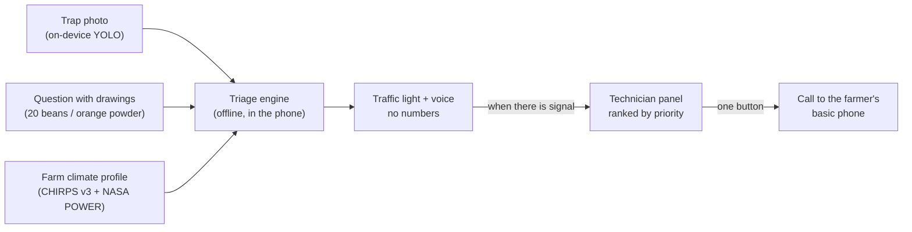

# Chakra Ñawi

**Offline triage that prioritizes co-op technician visits for smallholder coffee farmers in La Convención, Cusco (Peru). It is not an autonomous diagnosis.**

Hack-Nation 7th Global AI Hackathon · Challenge 04 "Small AI for Development" (World Bank) · Agriculture, Peru.

*Chakra Ñawi* means "eye of the field" in Quechua. *Español: [README.es.md](README.es.md).*

---

## The problem

In La Convención, coffee co-op technicians reach each farm only once or twice a year. Farmers usually find out that **coffee berry borer** (*broca*, *Hypothenemus hampei*) has spread in their plot at the point of sale, when the buyer discounts the bored beans. **Coffee leaf rust** (*roya*) and bad weather during flowering cause losses that farmers can easily confuse with each other.

Many of these farmers are older women. They have a basic phone, and a daughter or son with a cheap Android. In rural Peru, illiteracy is **33% among native-language women versus 9.3% among men** (INEI, 2017 Census), and almost nobody reads written Quechua. A text-heavy app, or a generic calendar SMS sent to every member, does not help them.

**The decision we improve:** *"What do I do on my farm this week: nothing, sanitation picking, or call the technician?"* At the same time, the technician gets a ranked list of who to visit first.

## How it works

Every two weeks, with no internet connection:

1. **Photo.** The farmer empties the borer trap onto a printed A5 card with four black corners, and the phone takes a photo. A small on-device **YOLO model (ONNX, int8, 3.2 MB)** counts the insects tile by tile. Boxes appear on screen while it counts.
2. **One question with drawings.** "Put one bean in each of the 20 circles. How many have a little hole?" → *none / 1–2 / many / I don't know*. In the rainy season: "Do you see orange powder under the leaves?" → *yes / no / I don't know*. A second question appears only if it could change the result.
3. **Result.** A traffic light, a drawing and a voice message. **No numbers, no percentages, no history** on the farmer's screens (this is enforced by an automated test).

| Result | Meaning | Recommendation |
|---|---|---|
| 🟢 Green | No problem detected | Keep going. "0 bored beans" alone **never** gives green |
| 🟡 Yellow | Likely borer, rust or weather | Cultural practices only (sanitation picking, collecting fallen beans). Chemical or biological control always goes through the technician |
| 👤 Technician | Uncertain case, old plants, "other cause", unreliable count | The case is sent to the technician |
| 👤 Technician (urgent) | Many bored beans while fruit can be attacked | The technician is alerted |

The case is stored on the phone and synced when there is signal. The technician sees it in a one-page panel ranked by priority, with the photo and boxes, the answers, and **every rule that fired, with its source**. One button **calls the farmer's basic phone** (Twilio) and plays the message.



## Why this is "small AI"

- **Runs fully offline** on a cheap Android as an installable PWA: model + runtime + audio are cached on the device.
- **The model is small and has a narrow job.** It only measures the *trend* of the trap count. The strong evidence for borer is the 20-bean question, because the trap measures flight, not infestation. **There is no official per-trap threshold**: the official metric is % of bored fruit, with 5% as the economic damage threshold (INIA).
- **A transparent triage engine** in TypeScript: Bayesian log-likelihood ratios, cited rules (each labeled *official*, *literature* or *assumption*), weights that change by season, and a cap on the combined LR per cause so that dependent evidence is not double-counted. No LLM anywhere in the system.
- **Speaks the farmer's language: Cusco Quechua (`quz`), by voice.** Every instruction, question and result in the app, and the phone call to her basic phone, play in Quechua (Spanish as file-by-file fallback). No reading needed. The Quechua voice is **synthetic** (Meta MMS-TTS) over texts drafted by the team; see the limits below.
- **Fail-safe by design.** When the system is unsure (bad photo, unreliable count, "I don't know"), it says so and sends the case to a person.

## Statistical honesty: why "0 of 20" is never green

The farmer samples 20 beans (binomial):

| True infestation | P(0 bored) | P(1–2) | P(3+) |
|---|---|---|---|
| 2% | 67% | 33% | < 1% |
| 5% (INIA threshold) | 36% | 57% | 8% |
| 15% | 4% | 37% | 60% |

With 0 out of 20, true infestation can still be as high as **16.8%** (Clopper-Pearson upper bound, two-sided 95%). That is why the answer options are 0 / 1–2 / 3+ and why "0" alone never produces green. Reproduce with `python validacion/binomial.py`.

## Data sources

| Data | Source | Use |
|---|---|---|
| Rainfall | **CHIRPS v3** (monthly COGs, Cusco clip) | Rain anomaly during flowering |
| Temperature, rainy days | **NASA POWER** daily `T2M`, `T2M_MAX`, `PRECTOTCORR`, altitude-corrected (−6.5 °C/km) | Rust-favorable temperature days and rainy-day anomaly vs 1991–2020; heat during flowering |
| Regional alerts | `data/alertas_activas.json`, curated by hand from official sources (SENASA, SENAMHI, ENFEN) with URL and literal quote. **Currently empty**; the engine works the same without it | Prior only |
| Quechua voice | **Meta MMS-TTS** `facebook/mms-tts-quz` (VITS, 36 M params, CC-BY-NC 4.0), run offline at build time with `audio/tts_quz.py`; 14 clips, 216 KB in Opus | Voice of the app and the call |
| Counter training data | **Synthetic** trap images generated in `ml/sintetico.py`, where 70% of the "borers" are cut-outs of **real bark beetles** (Scolytinae, the borer's subfamily) from [Marais et al. 2024](https://huggingface.co/datasets/ChristopherMarais/Andrew_Alpha_training_data), PLOS ONE, doi:10.1371/journal.pone.0310716, **CC-BY-SA-4.0** | YOLOv8n, 1 class |

Rust rules use **anomalies, not absolute values**. La Convención is humid every year, so absolute thresholds fired on all farms every year. What carries information is whether *this* year departs from the 1991–2020 normal.

## What we do NOT claim (data limits)

We take this part seriously. Full list (in Spanish): [`docs/LIMITES_DE_DATOS.md`](docs/LIMITES_DE_DATOS.md).

- **The model has never seen Peruvian coffee berry borer.** The counter in the app (`broca-y8n-v0-semireal`) is trained on synthetic trap images in which most "borers" are cut-outs of real bark beetles of four species. We test it on a **fifth species it never saw** (*Xylosandrus compactus*): count error MAE ≈ 11 insects per frame at the adopted 0.60 score threshold (it undercounts; ≈ 6 at 0.45, a proposed change not yet adopted), and 0.17 false detections per empty trap, versus 26 and 25 for the previous purely synthetic model. **This is a substitute, not borer performance**: the source photos are lab shots in ethanol with a ring flash, so phone lighting and the card's perspective correction are not measured. Details: [`ml/resultados/semireal/RESUMEN.md`](ml/resultados/semireal/RESUMEN.md).
- **Climate is a regional signal for the year, not a farm-level one.** All 5 farms fall in the same NASA POWER cell (~55 km), so only altitude differs between them. NASA POWER humidity and NDVI are deliberately left out: the cells are too coarse, the crop grows under shade, and Nov–Mar cloud cover is 79–90%.
- **9 of the 15 engine rules are assumptions**, and even for the cited ones the LR magnitude is an assumption, to be stress-tested with a ±50% sensitivity analysis.
- **The 5 farms are fictional examples** with plausible locations and altitudes in La Convención.
- **Voice: the Quechua is synthetic and not yet validated by a native speaker.** We could not find a Cusco Quechua speaker in time, so the 14 messages were translated by the team (drafts, in `contracts/mensajes.example.json` → `texto_quz`) and voiced with Meta MMS-TTS. MMS was trained mostly on read religious text, so its prosody is flat and may mispronounce loanwords; a wrong word in a farming instruction is a real risk, which is why every message stays short, has a drawing, and the technician confirms anything beyond cultural practices. The Spanish audio is also provisional TTS. All clips are labeled `sintetico: true`. **This is what localizing AI looks like for a less-supported language:** the open model exists, but the trust has to come from people — for the pilot, co-op members record the messages and a second speaker validates them ([`docs/GUION_AUDIOS.md`](docs/GUION_AUDIOS.md)); `audio/convertir.py` swaps them in without touching the app.
- Flowering and harvest months come from regional literature (±1 month by altitude) and are not yet confirmed with a co-op.

## Repository

| Folder | What it is | Tests |
|---|---|---|
| [`packages/motor`](packages/motor) | Triage engine (TypeScript): cited rules, seasonal weights, LR cap, traffic-light decision | 17 |
| [`apps/campo`](apps/campo) | Offline 3-screen PWA: photo quality control, perspective correction, tiled ONNX inference, offline queue, voice | 23 (incl. "zero numbers" test) |
| [`api`](api) | FastAPI + SQLite: idempotent `POST /casos`, serves the technician panel, places Twilio calls | 15 |
| [`apps/panel`](apps/panel) | One-page technician panel (no framework) | — |
| [`pipeline/ficha`](pipeline/ficha) | Farm climate profile from CHIRPS v3 + NASA POWER, as anomalies vs 1991–2020 | — |
| [`ml`](ml) | Synthetic + semi-real data generator (real beetle cut-outs), YOLOv8n/11n training, ONNX export (fp32/int8), evaluation on an unseen species, classic blob counter for comparison | — |
| [`contracts`](contracts) | JSON Schemas shared by all parts (frozen at hour 1) | `scripts/validar_contratos.py` |
| [`audio`](audio) | 14-message catalog and conversion to `.opus` (app) and `.mp3` (call) | — |
| [`docs`](docs) | Plan, architecture, data limits, printable A5 card (internal working docs are in Spanish) | — |

## Run it locally

Requirements: Python 3.11+ and Node 20.19+ (tested with Node 24).

```bash
# Python: API, pipeline, contract validator
python -m venv .venv && .venv/Scripts/pip install -r requirements.txt   # Windows (use .venv/bin on Linux/macOS)
python scripts/validar_contratos.py      # should print TODO VÁLIDO ("all valid")
uvicorn api.app:app --reload             # http://localhost:8000 · technician panel at /panel
python -m api.demo_casos                 # optional: load 5 demo cases (synthetic photos labeled DEMO)

# JavaScript: engine and PWA
npm install
npm test                                 # engine + PWA tests
npm run dev                              # PWA at http://localhost:5173 (proxies /api to localhost:8000)
```

Without Twilio credentials in `api/.env` (see `api/.env.example`), calls are **simulated** and the panel says so.

### Try it on a real Android phone

The camera, the service worker and `crypto.randomUUID` require HTTPS:

```bash
npm run dev:lan -w apps/campo            # https://<laptop-IP>:5173 with a self-signed certificate
# or the production build:
npm run build && npm run preview -w apps/campo
```

1. Open the address, wait for everything to load, and install the app ("Add to Home screen").
2. Turn on **airplane mode** and run a full triage.
3. **Long-press the logo** to open technician mode: farm, language, demo month (e.g. an August case versus a January case), ms per tile, total stored size and the case queue.
4. Turn airplane mode off: queued cases are sent to the API and appear in the panel.

No printed card? Use `docs/demo/foto_tarjeta_sintetica.jpg` (synthetic photo in perspective). The printable card is [`docs/tarjeta/tarjeta_A5.pdf`](docs/tarjeta/tarjeta_A5.pdf).

## Next steps

- Replace the synthetic Quechua with messages recorded by co-op members and validated by a second speaker.
- Retrain the counter on real phone photos of substitute insects on the printed card, then evaluate on real borer photos with permission from CATIE/CIRAD.
- Pilot with one co-op, measured by two indicators: % of members doing sanitation picking within 2 weeks, and % of bored beans at collection.

Ideas deliberately left out of the MVP (in Spanish): [`docs/LO_QUE_SIGUE.md`](docs/LO_QUE_SIGUE.md).

## License

The counter uses Ultralytics YOLO (AGPL-3.0), so this repository is public under AGPL-3.0. Data sources are public (CHIRPS, NASA POWER). The Quechua voice model `mms-tts-quz` (Meta MMS) is CC-BY-NC 4.0: the generated clips may only be used non-commercially, so a commercial deployment needs human recordings (planned anyway).
