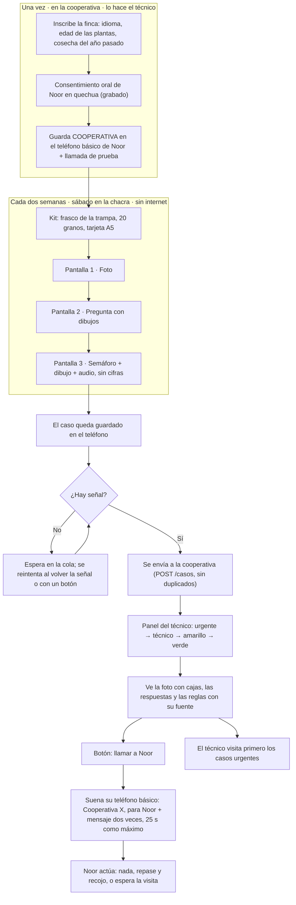
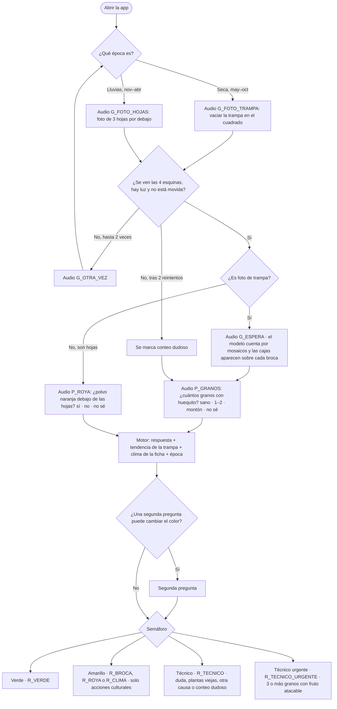

# Flujo de uso

Basado en PLAN §4 y §5.2. GitHub dibuja los diagramas Mermaid.

## 1. El recorrido completo (personas y canales)

## 2. Las tres pantallas, con sus decisiones

Reglas que el diagrama no muestra: un "0 granos" nunca da verde por sí solo, y "no sé" en los granos tampoco (PLAN §5.2).
